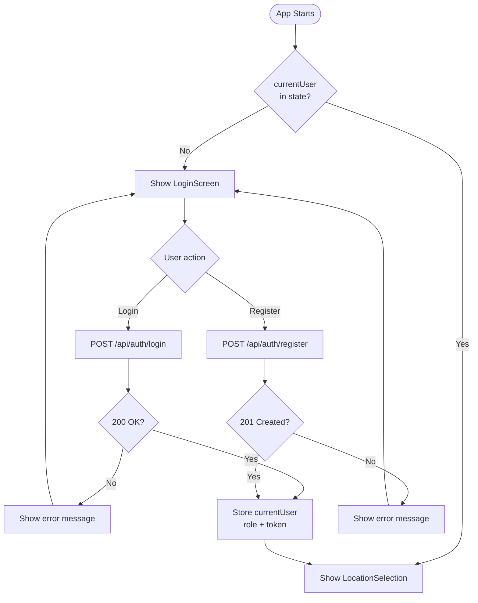
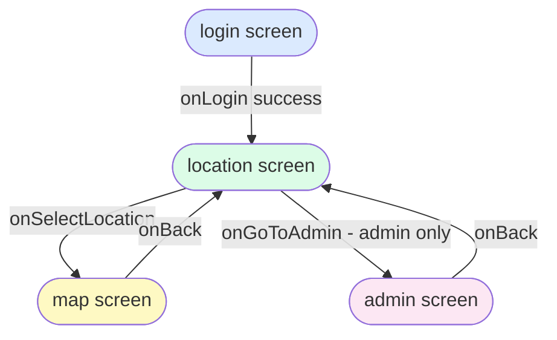
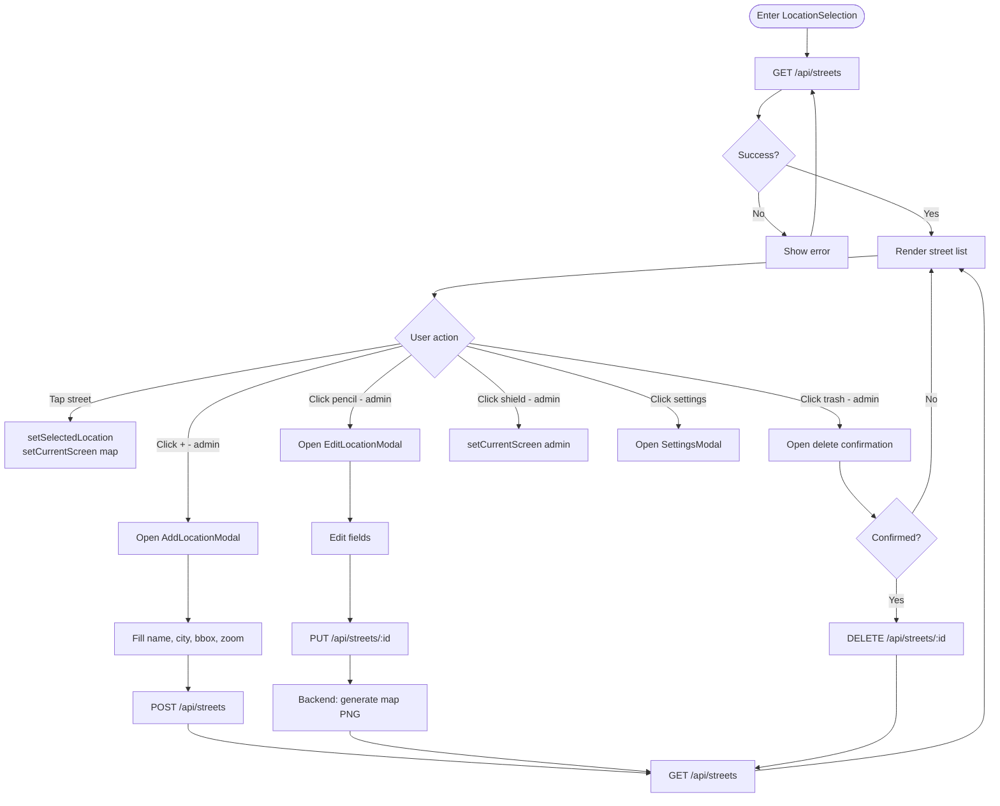
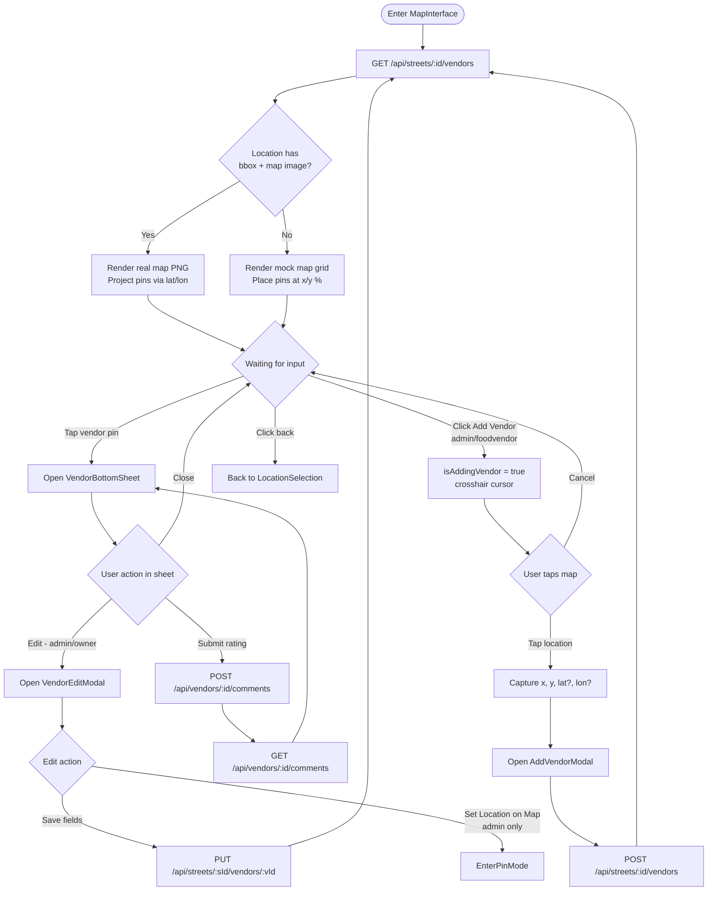
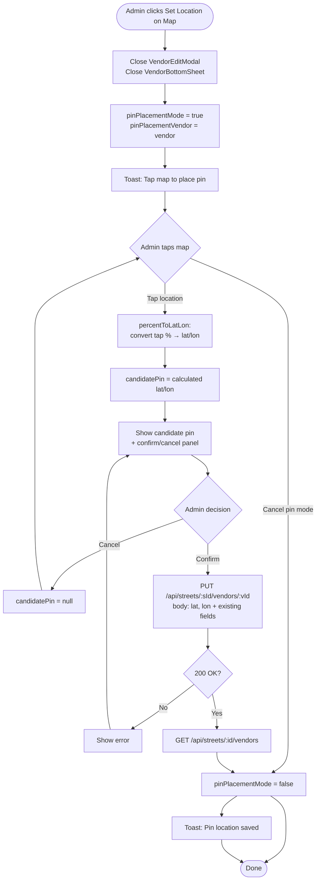
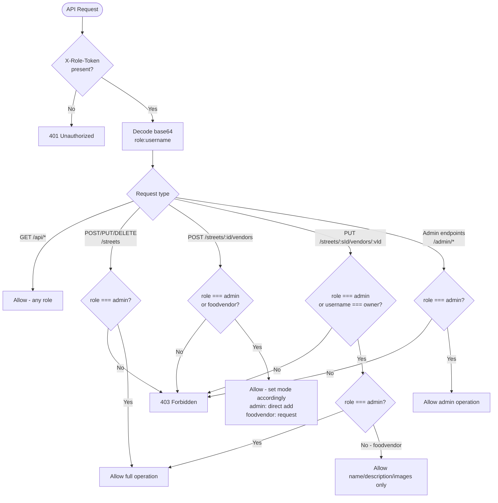
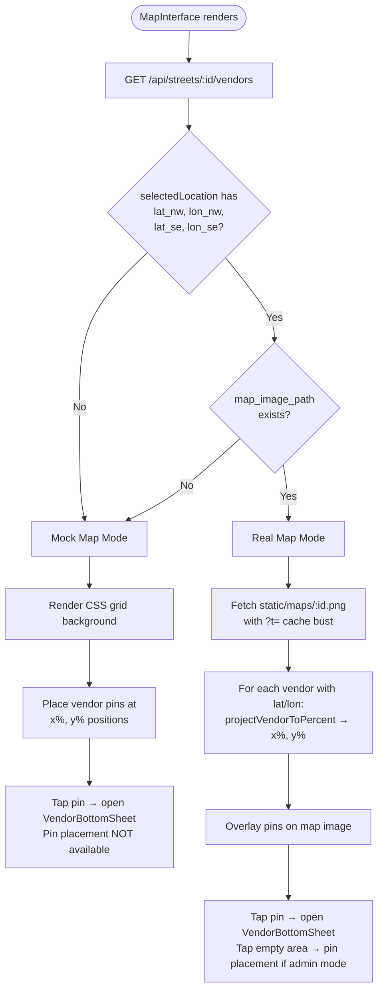
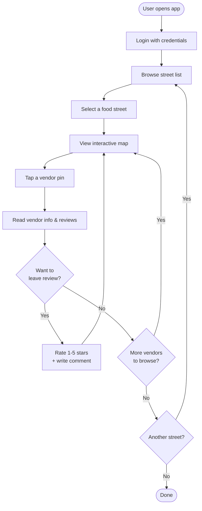

# Activity Diagrams

## 1. Application Startup & Auth Flow



## 2. Screen Navigation State Machine



## 3. Location Selection Screen Activity



## 4. Map Interface Activity



## 5. Pin Placement Mode (Admin)



## 6. Vendor Authorization Rules



## 7. Map Rendering Decision



## 8. Comment & Rating Flow

```mermaid
flowchart TD
    Open([Open VendorBottomSheet]) --> FetchComments[GET /api/vendors/:id/comments]
    FetchComments --> ShowVendor[Show vendor name, avg rating,\nreview count, comment list]

    ShowVendor --> UserChoice{User action}
    UserChoice -->|Close| End([Close sheet])
    UserChoice -->|Rate & Review| ShowForm[Show VendorRateForm]

    ShowForm --> FillForm[Select star rating 1-5\nWrite comment body]
    FillForm --> Submit[POST /api/vendors/:vendorId/comments\n{rating, body}]
    Submit --> PostOK{201 Created?}
    PostOK -->|No| ShowFormError[Show error] --> ShowForm
    PostOK -->|Yes| BackendRecalc[Backend: UPDATE vendors\nSET rating = avg, reviews = count]
    BackendRecalc --> RefreshComments[GET /api/vendors/:id/comments]
    RefreshComments --> ShowVendor
```

## 9. Admin Dashboard Activity

```mermaid
flowchart TD
    Enter([Enter AdminScreen]) --> LoadStats[GET /api/admin/stats]
    LoadStats --> ShowDashboard[Show stats cards:\nstreets, vendors, users, comments]

    ShowDashboard --> TabChoice{Active tab}

    TabChoice -->|Users| LoadUsers[GET /api/admin/users]
    LoadUsers --> ShowUsers[Show user list with roles]
    ShowUsers --> UserMgmt{User action}
    UserMgmt -->|Change role - not self| PutUser[PUT /api/admin/users/:id {role}]
    UserMgmt -->|Delete user - not self| DeleteUser[DELETE /api/admin/users/:id]
    PutUser --> LoadUsers
    DeleteUser --> LoadUsers

    TabChoice -->|Vendors| LoadVendors[GET /api/admin/vendors]
    LoadVendors --> ShowVendors[Show all vendors with\nstreet name, owner, rating]

    TabChoice -->|Comments| LoadComments[GET /api/admin/comments]
    LoadComments --> ShowComments[Show all comments with\nvendor name, username, rating]
    ShowComments --> CommentMgmt{Admin action}
    CommentMgmt -->|Delete comment| DeleteComment[DELETE /api/vendors/:vId/comments/:cId]
    DeleteComment --> LoadComments

    TabChoice -->|Back| GoBack[setCurrentScreen location] --> Done([Done])
```

## 10. Full User Journey (Happy Path)


