# Sequence Diagrams

## 1. User Login

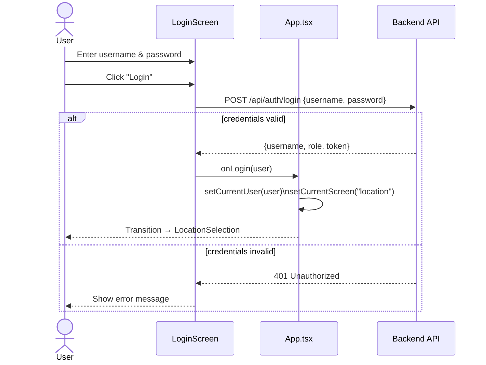

## 2. User Registration

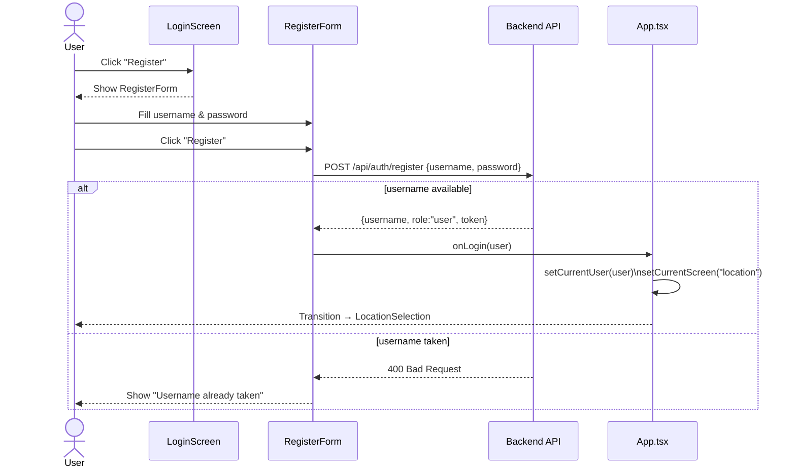

## 3. Browse Locations and Select a Street

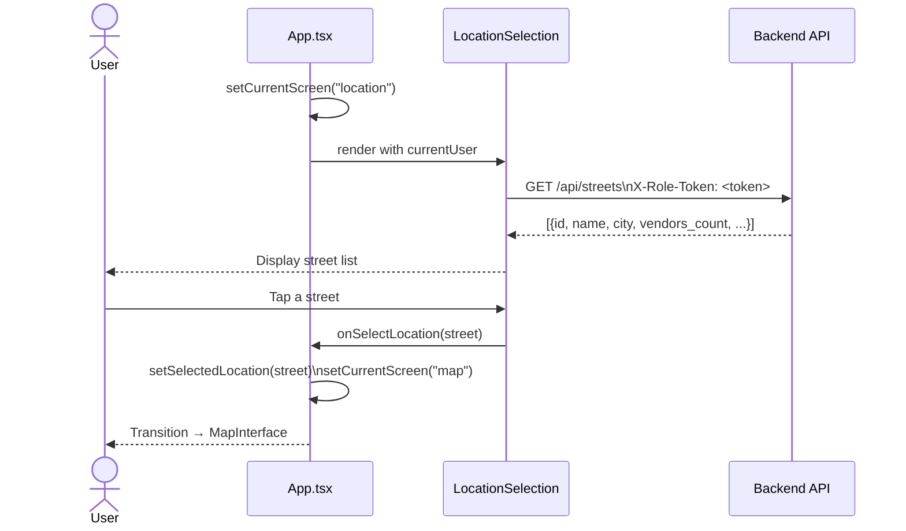

## 4. View Map and Vendor Details

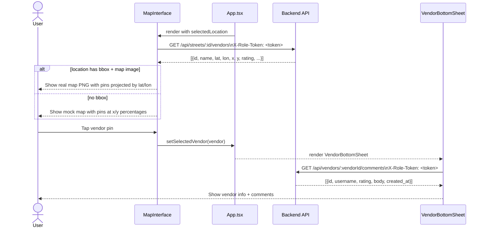

## 5. Submit a Comment / Rating

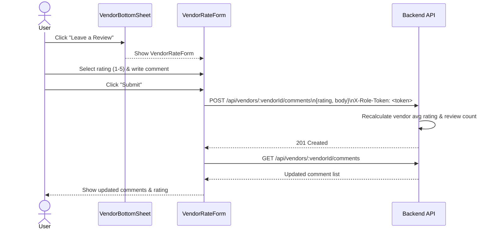

## 6. Add a Vendor (Foodvendor / Admin)

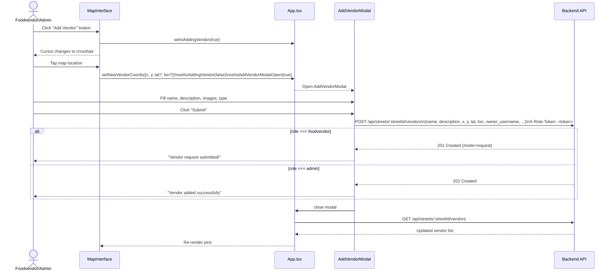

## 7. Admin: Set Vendor Pin Location

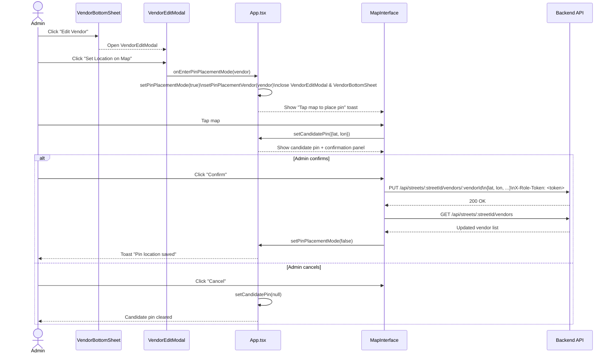

## 8. Admin: Add a New Street/Location

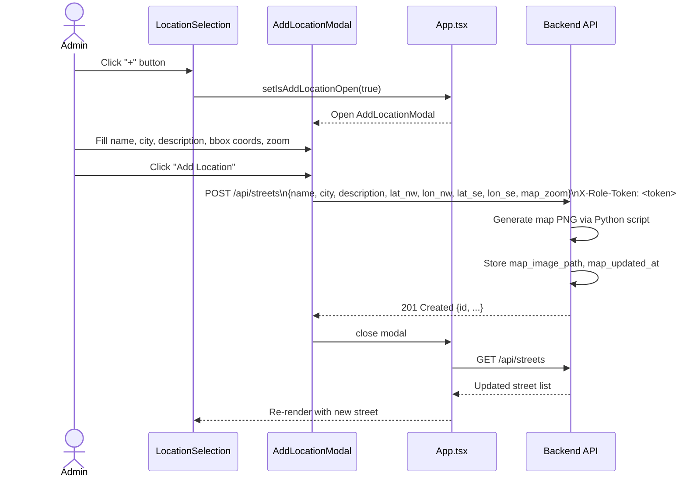

## 9. Admin: Edit Street Bounding Box

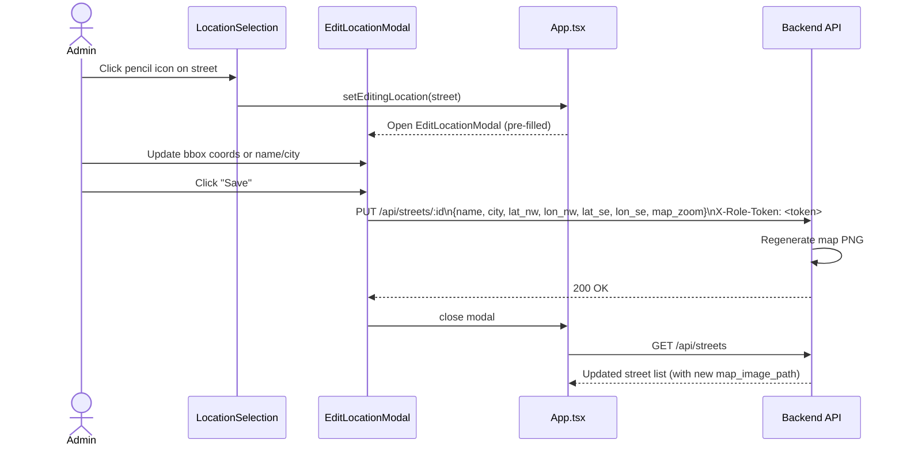

## 10. Admin Dashboard

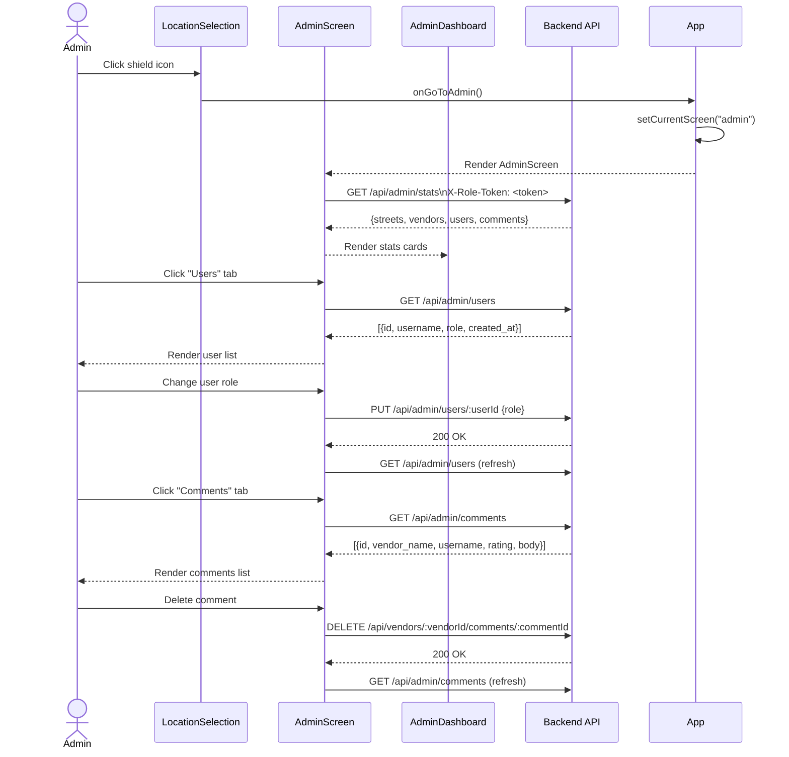

## 11. Change Password

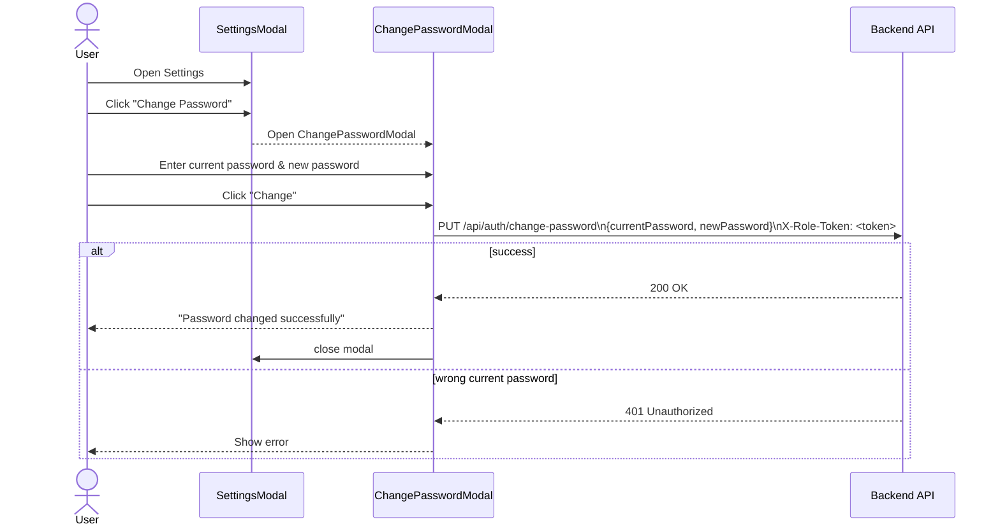

## 12. Language Selection

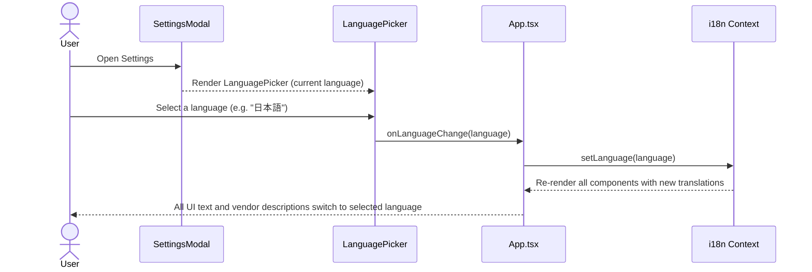

## 13. Vendor Description Auto-Translation

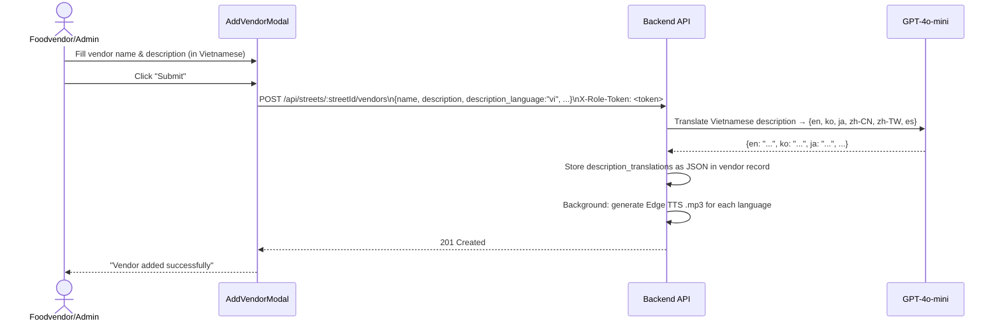

## 14. Manual TTS Playback (Vendor Detail)

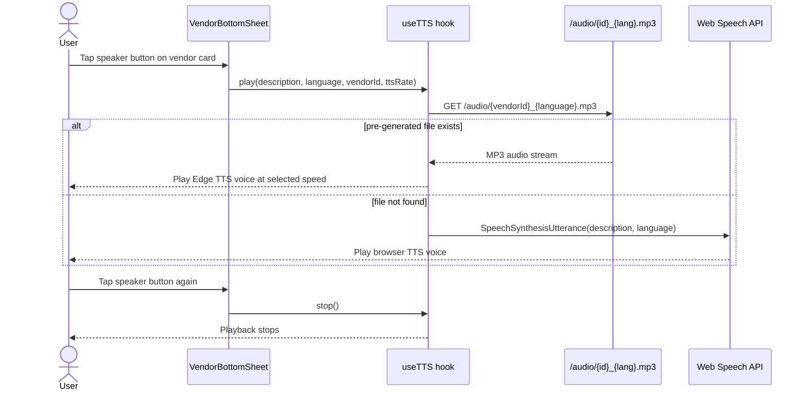

## 15. Proximity-based Auto-narration

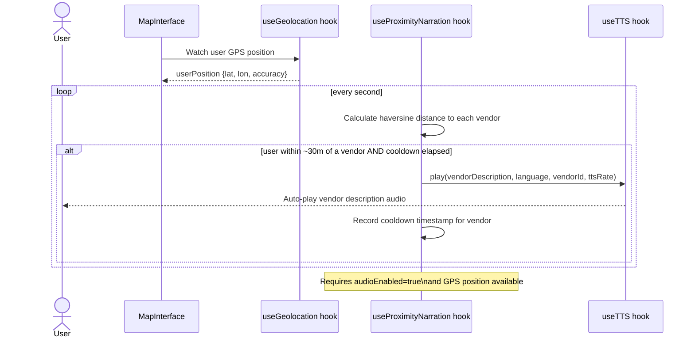

## 16. TTS Settings Configuration

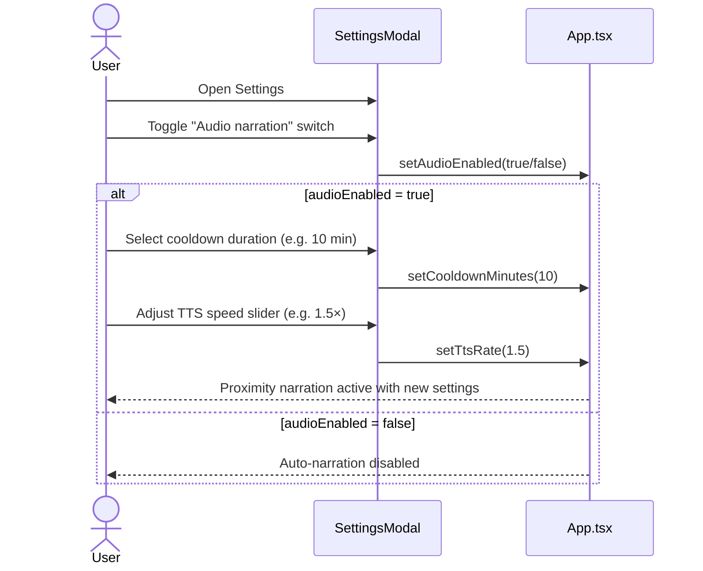

## 17. GPS User Location Display

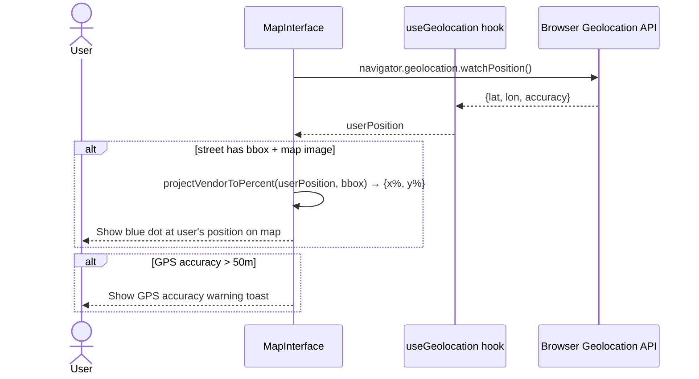
